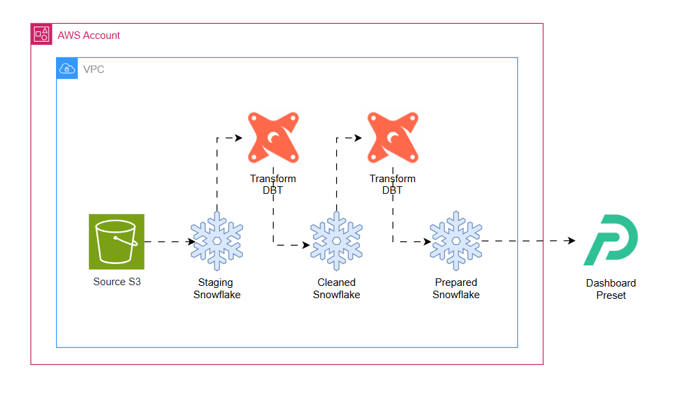

## Analysing Airbnb Berlin 

An end-to-end data project exploring Airbnb listings in Berlin using a Modern Data Stack. The goal is to ingest raw marketplace data, transform it into analytical models, and generate insights on pricing, host behavior, and neighborhood patterns.

## Technical Trade-offs and Design Rationale: 

### ❄️ Snowflake as the Data Warehouse

#### Why
- Simple auto-scaling and separation of compute and storage
- No infrastructure management
- Strong support for semi-structured data (JSON)

#### Trade-offs
- Cost can grow without warehouse/role governance
- Vendor lock-in

### ⚙️ dbt for Transformation and Modeling

#### Why
- Industry-standard SQL-first ELT approach
- Built-in testing, docs, lineage, versioning
- Separates business logic from warehouse implementation

#### Trade-offs
- Incremental models need discipline to avoid full refresh
- Project quality depends heavily on conventions and structure

### 📊 Preset (Apache Superset) for BI and Analytics
#### Why
Open-source foundation with a managed SaaS option
- Fast visual analysis with SQL control
- Strong Snowflake integration

#### Trade-offs
- Higher learning curve than drag-and-drop BI tools
- Dashboard governance less mature than Looker/Power BI

## ✅ Features

#### ELT pipeline from raw to cleaned, analytical datasets
#### Source freshness and schema testing using dbt
#### Dimensional modeling: staging, intermediate, and mart layers
#### Dashboard with KPIs, pricing heatmaps, and host analytics
#

